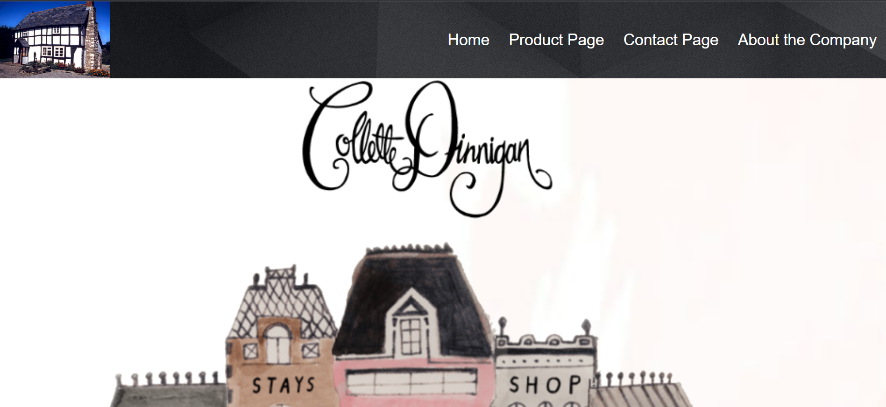
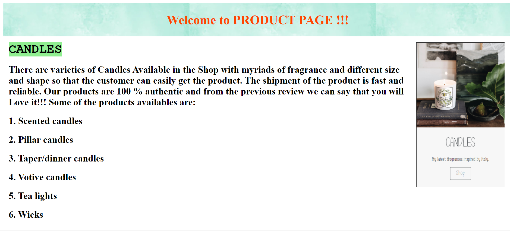
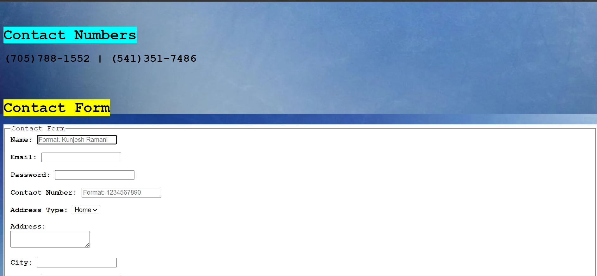
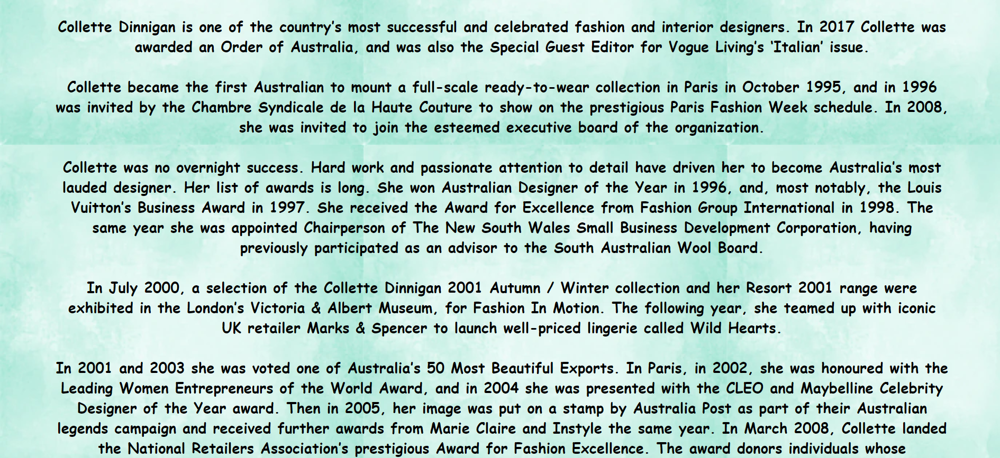

# **Retro Website**

## **Introduction**

A responsive retro website has been created. The website is similar to that of the 19th century. It is well-formatted and has a polished finish.

* #### Initially, the user will be directed to the Home page of the website

* #### There are a total of 4 pages on the website (1) Home (2) Product page (3) Contact Page (4) About the Company

* #### On the Home page, there is a header section that directs to other pages. In the main section, there is the company's picture and logo

* #### On the Product page, there are various product pictures with descriptions available for the customer to choose from. The layout is created using CSS flex and gird

* #### On the Contact page, there is the company's contact information available. There is also a contact form for customers to reach out to the company for any questions.

* ####  On the About the company page, general information about the company is added.

You can clone & run this website in your PC.

## **Programming Language and Technologies used**

* [x] HTML, CSS & JS

* [x] Visual Studio Code

* [x] Git

## **Concepts Used**

> 1. HTML boilerplate
>
> 2. HTML tags
>
> 3. External CSS
>
> 4. CSS selectors, pseudo-selectors, pseudo-element, specificity, background properties, border properties, flex, grid
>
> 5. Basic Javascript

## **Resources**

1. Class Notes
2. Google

## **Screenshots**

<h2><b>Home</b></h2>

<h2><b>Product</b></h2>

<h2><b>Contact</b></h2>

<h2><b>About</b></h2>

# 
**A Big Thank You!**

